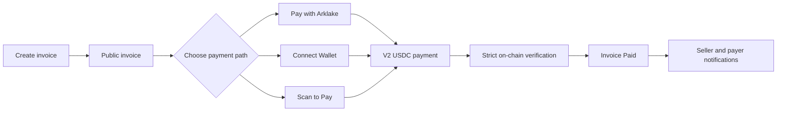
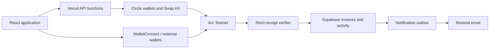

# Arklake

**Stablecoin payments, made simple.**

[Open the live product](https://arklake.site) · Running on **Arc Testnet**

Arklake is an account-first stablecoin wallet and invoicing experience. It combines familiar payment flows with verifiable settlement on Arc, so people can send, receive, swap, create invoices, and pay from an Arklake wallet or an external wallet.

## What it does

- Account-based wallets powered by Circle User-Controlled Wallets
- USDC Send and Receive with confirmed transaction activity
- Swaps between supported Arc assets, including USDC, EURC, and cirBTC when a route is available
- Invoice creation, public payment pages, lifecycle tracking, email notifications, and downloadable PDFs
- Three invoice payment paths: **Pay with Arklake**, **Connect Wallet**, and **Scan to Pay**
- Verifiable invoice payment references and plaintext Memo recorded on Arc.
- Strict server-side payment verification before an invoice becomes Paid

## Invoice payment flow



Each path uses server-authoritative invoice data for the recipient, amount, invoice number, and Memo. The payment calls the V2 invoice payment contract, transfers canonical USDC, and emits an `InvoicePayment` event. Arklake then verifies the successful Arc receipt, payer, recipient, token, amount, reference, Memo, payment window, and transaction uniqueness.

**Submitted does not mean Paid.** An invoice moves to Paid only after strict verification succeeds.

## Current capabilities

| Area | Available today |
| --- | --- |
| Wallet | Circle wallet provisioning, balances, Send, Receive, and confirmed activity |
| Swap | Live quotes and confirmed swaps across supported Arc assets, subject to available routes |
| Invoices | Create, view, pay, expire, download PDF, and track verified Paid state |
| Payment access | Arklake wallet, injected external wallet, and WalletConnect QR |
| Notifications | Invoice and transaction email with retry, idempotency, and invoice-payment suppression |
| Proof | Arcscan-visible USDC transfer plus exact invoice reference and plaintext Memo |

## Built on Arc

Arklake currently runs on **Arc Testnet** (`chainId 5042002`) and uses canonical Arc Testnet USDC at `0x3600000000000000000000000000000000000000`.

Circle provides user-controlled smart contract wallets and transaction infrastructure. WalletConnect supports Scan to Pay from another device. Arc receipts and logs provide the settlement evidence used by Arklake's verifier.

## On-chain invoice proof

Arklake invoice payments call the testnet V2 contract at [`0x7Ef8D661e800ec959daAaE67A8bD4fAaAe3A43D7`](https://testnet.arcscan.app/address/0x7Ef8D661e800ec959daAaE67A8bD4fAaAe3A43D7).

The contract:

- transfers the exact canonical USDC amount from payer to recipient;
- emits the invoice number as `paymentReference`;
- emits the invoice Description as plaintext `memo`, limited to 64 UTF-8 bytes for payment;
- prevents reuse of the same reference;
- retains no USDC after a successful payment.

The contract is deployed and verified on Arc Testnet. Its source, deployment evidence, runtime proofs, and lifecycle status are recorded in [App-owned proof for Arklake](docs/arklake-onchain-provenance.md).

## Architecture



## Local development

Requirements: Node.js, npm, and the project environment variables for Vercel, Circle, Supabase, WalletConnect/Reown, and Resend.

```bash
npm install
npx vercel dev --listen 3000
```

Validation:

```bash
node --experimental-vm-modules --test tests/*.test.mjs
npm run build
```

## Documentation

- [Current project state](PROJECT_STATE.md)
- [App-owned on-chain provenance](docs/arklake-onchain-provenance.md)
- [On-chain invoice reference prototype](prototype/onchain-invoice-reference/README.md)
- [Arklake design system](docs/ARKLAKE-DESIGN-SYSTEM.md)
- [Arc official sources used by the project](references/arc-official-sources.md)

Arklake is an active product running against Arc Testnet. Testnet assets have no production monetary value.
